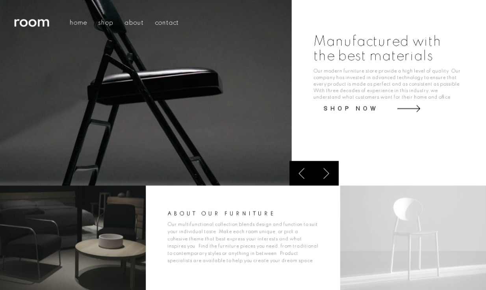

# Frontend Mentor - Room homepage solution

This is a solution to the [Room homepage challenge on Frontend Mentor](https://www.frontendmentor.io/challenges/room-homepage-BtdBY_ENq). Frontend Mentor challenges help you improve your coding skills by building realistic projects. 

## Table of contents

- [Overview](#overview)
  - [The challenge](#the-challenge)
  - [Screenshot](#screenshot)
  - [Links](#links)
- [My process](#my-process)
  - [Built with](#built-with)
  - [What I learned](#what-i-learned)
  - [Continued development](#continued-development)
  - [Useful resources](#useful-resources)
- [Author](#author)
- [Acknowledgments](#acknowledgments)

**Note: Delete this note and update the table of contents based on what sections you keep.**

## Overview

### The challenge

Users should be able to:

- View the optimal layout for the site depending on their device's screen size
- See hover states for all interactive elements on the page
- Navigate the slider using either their mouse/trackpad or keyboard

### Screenshot



### Links
- Live Site URL: [live site URL here](https://frontend-mentor-room-homepage.netlify.app/)

## My process

### Built with

- CSS custom properties
- Flexbox
- CSS Grid
- Mobile-first workflow
- [Sass](https://sass-lang.com/) - CSS preprocessor
- [React](https://reactjs.org/) - JS library
  - React Hooks

### What I learned

In this project i learned:
- To implement react hooks
- Use the useState and useEffect hooks
- Using function components instead of class components
- Javascript destructuring when passing props and to map in an array of objects

```js
const Header = () => {
    let images = [mobile_image_1, mobile_image_2, mobile_image_3]
    const [value, setValue] = useState('none');
    const [index, setIndex] = useState(0);

    const prevClick = () => {
      setIndex(index === 0 ? images.length - 1 : index - 1)
    }
    const nextClick = useCallback(() => {
      setIndex(index === images.length - 1 ? 0 : index + 1)
    }, [images.length, index])

    useEffect(() => {
      let interval = setInterval(nextClick, 5000);
      return () => clearInterval(interval);
    }, [index, nextClick]);

    return <header>
    <div className='nav_container'>
      <figure className='burger_and_logo_container'>
         setValue('flex')}/>
        
      </figure>
      <nav className='navbar' style={{display: value}}>
          <figure className='close_container'>
             setValue('none')} />
          </figure>
          <ul>
            <li>Home</li>
            <li>Shop</li>
            <li>About</li>
            <li>Contact</li>
          </ul>
        </nav>
    </div>
    <div className='images_container'>
      <ShowCurrentImage images={images} index={index}/>
      <div className='arrows_container'>
        <div className='arrow left' onClick={prevClick}></div>
        <div className='arrow right' onClick={nextClick}></div>
      </div>
    </div>
    <div className='header_article_container'>
    <ShowCurrentArticle index={index} />
            {/*<h2>Discover innovative ways to decorate</h2>
            <p>We provide unmatched quality, comfort, and style for property owners across the country.
                Our experts combine form and function in bringing your vision to life. Create a room in your
                own style with our collection and make your property a reflection of you and what you love.</p>*/}
            <div className='button_container'>
              <button>Shop now</button>
            </div>
        </div>
  </header>
}
```
```css
.proud-of-this-css {
  color: papayawhip;
}
```
```js
const proudOfThisFunc = () => {
  console.log('🎉')
}
```

If you want more help with writing markdown, we'd recommend checking out [The Markdown Guide](https://www.markdownguide.org/) to learn more.

**Note: Delete this note and the content within this section and replace with your own learnings.**

### Continued development

Use this section to outline areas that you want to continue focusing on in future projects. These could be concepts you're still not completely comfortable with or techniques you found useful that you want to refine and perfect.

**Note: Delete this note and the content within this section and replace with your own plans for continued development.**

### Useful resources

- [Example resource 1](https://www.example.com) - This helped me for XYZ reason. I really liked this pattern and will use it going forward.
- [Example resource 2](https://www.example.com) - This is an amazing article which helped me finally understand XYZ. I'd recommend it to anyone still learning this concept.

**Note: Delete this note and replace the list above with resources that helped you during the challenge. These could come in handy for anyone viewing your solution or for yourself when you look back on this project in the future.**

## Author

- Website - [Add your name here](https://www.your-site.com)
- Frontend Mentor - [@yourusername](https://www.frontendmentor.io/profile/yourusername)
- Twitter - [@yourusername](https://www.twitter.com/yourusername)

**Note: Delete this note and add/remove/edit lines above based on what links you'd like to share.**

## Acknowledgments

This is where you can give a hat tip to anyone who helped you out on this project. Perhaps you worked in a team or got some inspiration from someone else's solution. This is the perfect place to give them some credit.

**Note: Delete this note and edit this section's content as necessary. If you completed this challenge by yourself, feel free to delete this section entirely.**
